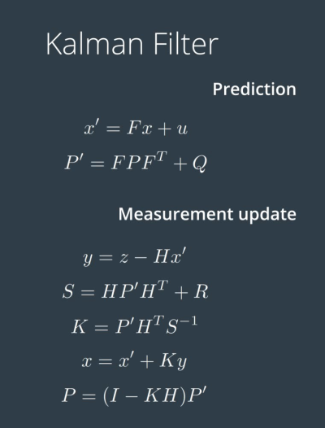
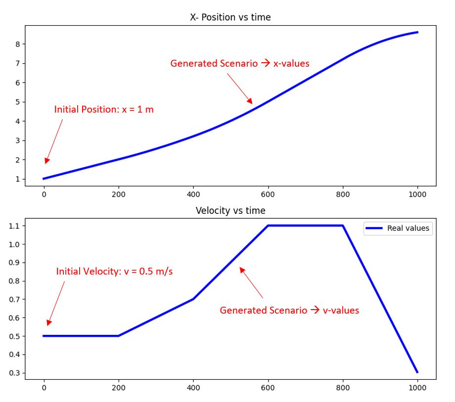
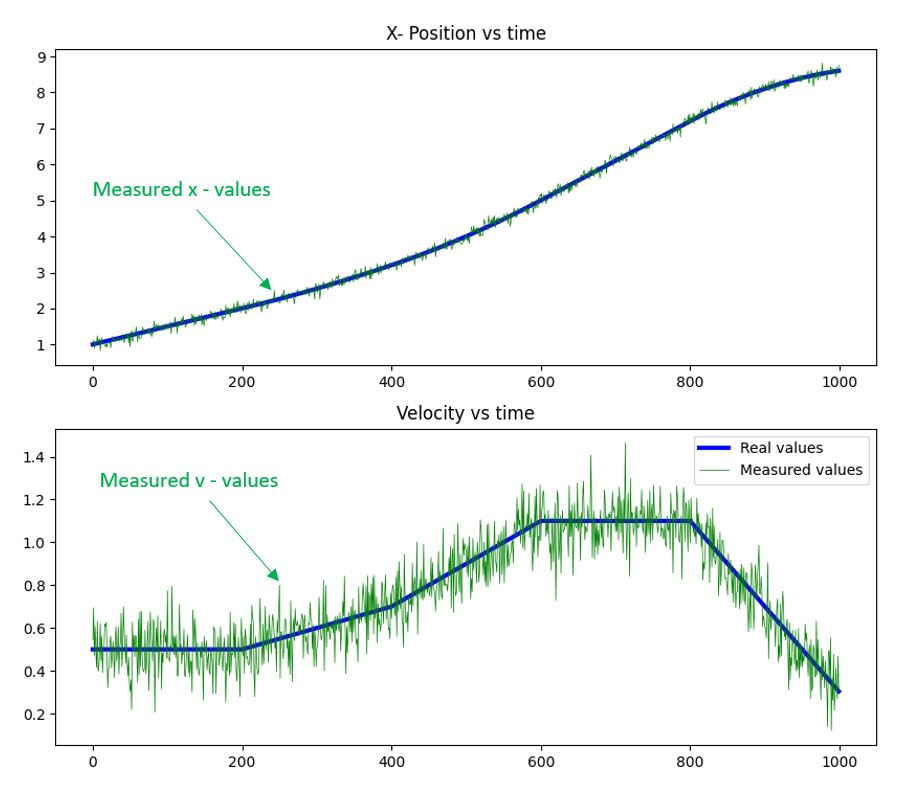
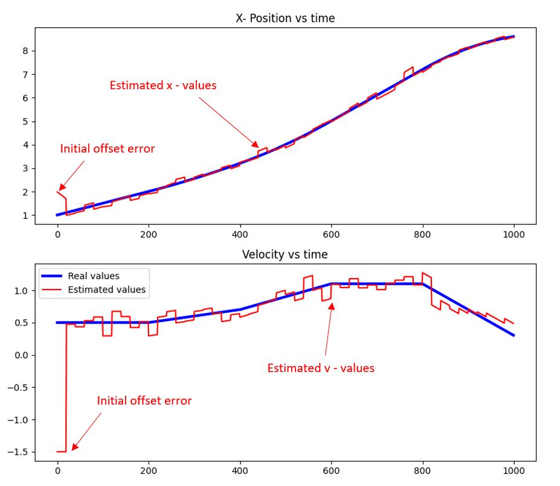
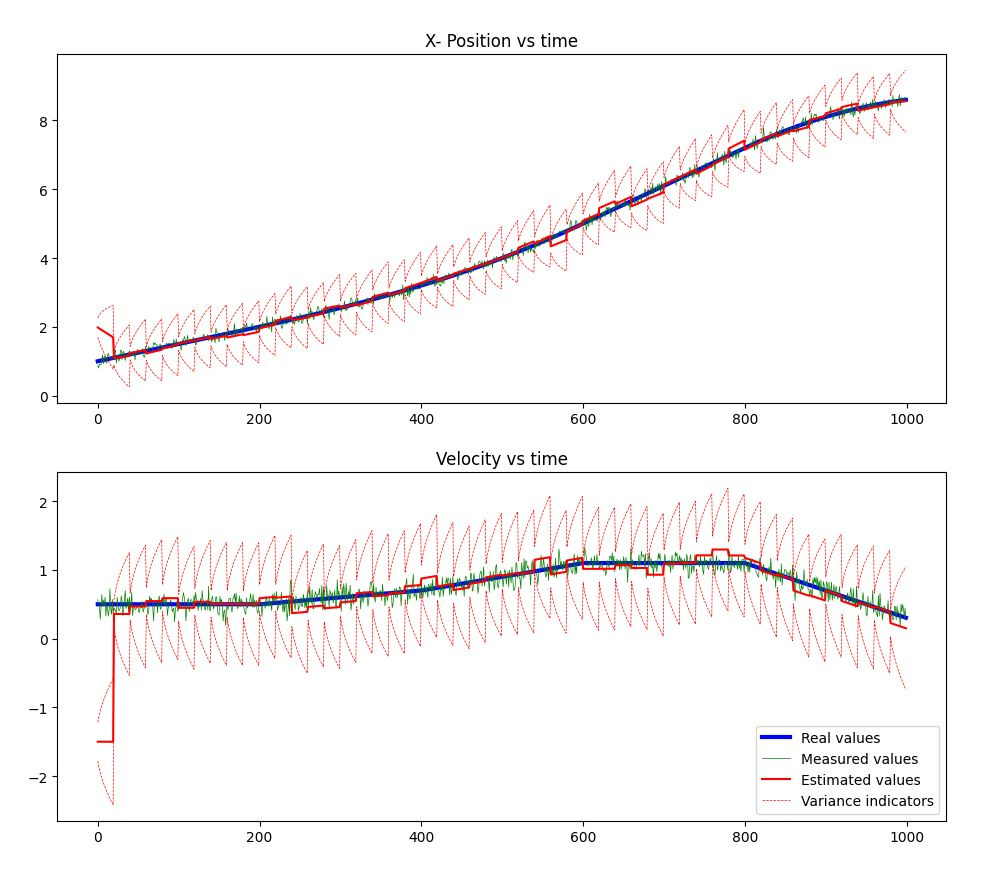

[comment]: <> (README file)

# Understanding Kalman Filter
 

#### Implemented Kalman filter from scratch. 

 
 
 

Scenario & Overview:
* Vehicle moves in x-direction
* Real values of x-position and x-velocity were generated
* Vehicle model/plant was created to predict values of x-position and x-velocity
* Measurements of the same were obtained by adding gaussian noise to real values
* Kalman Filter was implemented to obtain the best estimations

## Generated Scenario Values:

 
 

## Measurement Values:

 
 

## Kalman-Filter Estimated Values:

 
 
 
 
 

# Kalman-Filter OVERVIEW:

 
 

